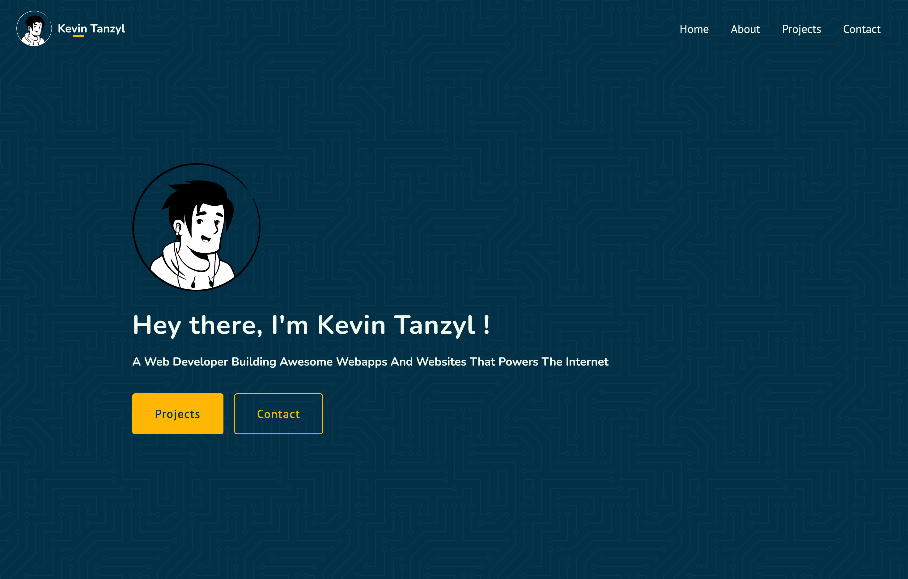

# Personal Portfolio Website

## My process

A single page personal portfolio website showcasing my own info, contact details and projects. 

The decision to build my site on NextJS is to make the project flexible for future implementations.

### Built with

- Semantic HTML5 markup
- CSS custom properties
- Mobile-first workflow
- [SASS](https://sass-lang.com/) - A CSS Preprocessor
- [React](https://reactjs.org/) - JS library
- [NextJS](https://nextjs.org/) - React framework

### Acknowledgments

- Design was based on <a target="_blank" href="https://github.com/rammcodes/wowfolio">WowFolio template</a> by <a target="_blank" href="https://rammaheshwari.com">Ram Maheshwari</a>
